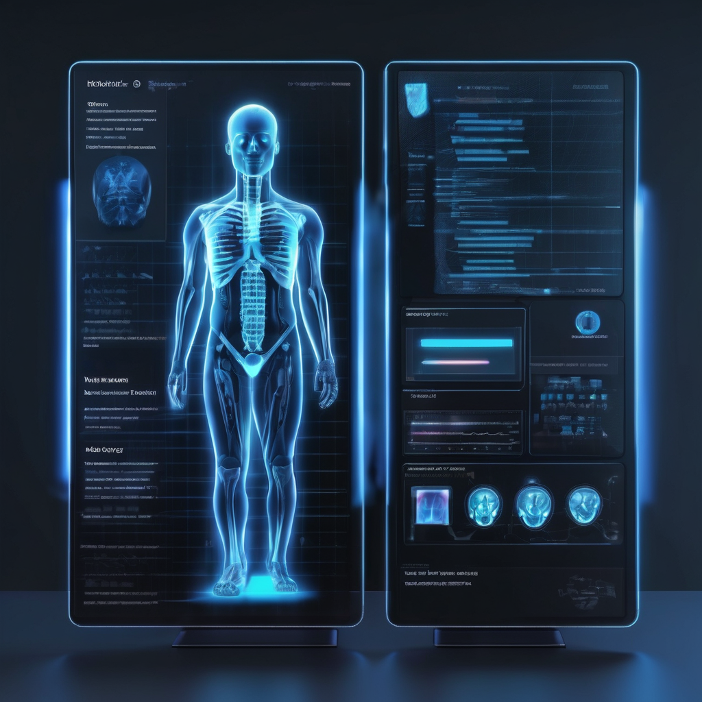

<p align="center">
  
</p>

<h1 align="center">XrayView</h1>

<p align="center">
  <b>Прозрачный виджет рентген-снимков для рабочего стола Windows</b><br>
  <i>Transparent X-ray viewer widget for Windows desktop</i>
</p>

<p align="center">
  
  
  
  
</p>

---

## Описание / Description

### RU

**XrayView** — компактный плагин для рабочего стола Windows, который выводит рентген-снимки (или любые изображения) в прозрачном окне поверх рабочего стола.

**Возможности:**
- Два изображения друг под другом с одинаковым размером
- Полностью прозрачный фон (настраивается слайдером)
- Перемещение мышкой за любую область
- Настройка размера изображений
- Минимизация в системный трей
- Сохранение положения и настроек между сессиями
- Автозапуск при старте Windows

### EN

**XrayView** — a transparent desktop widget for Windows that displays X-ray images (or any images) in a floating window on your desktop.

**Features:**
- Two images stacked vertically with equal sizing
- Fully transparent background (adjustable via slider)
- Drag-and-drop by any area of the window
- Adjustable image size
- System tray minimization
- Saves position and settings between sessions
- Auto-start on Windows login

---

## Скриншоты / Screenshots

<p align="center">
  
</p>

---

## Быстрый старт / Quick Start

### Скачивание / Download

Скачайте `XrayDesktop.exe` из раздела [Releases](../../releases) и запустите.

Download `XrayDesktop.exe` from the [Releases](../../releases) section and run it.

### Сборка из исходников / Build from Source

```bash
git clone https://github.com/USER/xrayview.git
cd xrayview
dotnet publish -c Release -r win-x64 --self-contained -p:PublishSingleFile=true
```

---

## Использование / Usage

| Действие / Action | Описание / Description |
|---|---|
| **ЛКМ + перетаскивание** | Перемещение окна / Move window |
| **ПКМ** | Контекстное меню с настройками / Context menu with settings |
| **Слайдер прозрачности** | 10% — 100% / Adjustable opacity |
| **Слайдер размера** | 100px — 800px / Adjustable image width |
| **Минимизация** | Сворачивается в трей / Minimize to tray |
| **Двойной клик по трею** | Показать окно / Show window |

---

## Требования / Requirements

- Windows 10/11 (x64)
- .NET 8.0 Runtime (вcluded in self-contained build)

---

## Технологии / Tech Stack

- **C# / WPF** — интерфейс / UI
- **System.Net.Http** — загрузка изображений / Image downloading
- **System.Text.Json** — сохранение настроек / Settings persistence
- **System.Windows.Forms** — тре Tray / System tray
- **Microsoft.Win32** — автозапуск / Autostart registry

---

## Лицензия / License

MIT License — свободное использование и модификация / Free to use and modify.

---

<p align="center">
  <sub>Made with care for the radiology community</sub><br>
  <sub>Сделано с заботой о радиологическом сообществе</sub>
</p>
